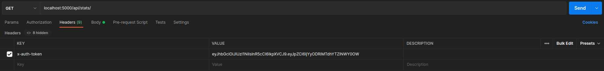

# QUIZ API Docs

Providing auth token


1. ### User Registration
   URL: `/api/auth/register`
   Request Type: `POST`
   Request Body:
   ```json
   {
     "name": "Jane Smith",
     "email": "jane.smith@exmaple.com",
     "password": "janesmith"
   }
   ```
   Sample Response:
   ```json
   {
     "code": 200,
     "msg": "User registered successfully.",
     "data": null
   }
   ```
2. ### User Login

   URL: `/api/auth/login`
   Request Type: `POST`
   Request Body:

   ```json
   {
     "email": "jane.smith@example.com",
     "password": "janesmith"
   }
   ```

   Sample Response:

   ```json
   {
     "code": 200,
     "msg": "Login successful",
     "data": {
       "id": "6285e4da3644f8ba10257c28",
       "name": "Jane Smith",
       "email": "jane.smith@example.com",
       "token": "eyJhbGciOiJIUzI1NiIsInR5cCI6IkpXVCJ9.eyJpZCI6IjYyODVlNGRhMzY0NGY4..."
     }
   }
   ```

3. ### Create a new Quiz

   URL: `/api/quiz`
   Request Type: `POST`
   Header Params: `x-auth-token: (jwt token recieved upon user login)`
   Request Body:

   ```json
   {
     "title": "Chemistry MCQ",
     "description": "This is a Chemistry MCQ"
   }
   ```

   Sample Response:

   ```json
   {
     "code": 200,
     "msg": "Quiz created successfully.",
     "data": null
   }
   ```

4. ### Add questions to a quiz
   URL: `/api/quiz/:quizId`
   Request Type: `POST`
   Header Params: `x-auth-token: (jwt token recieved upon user login)`
   Request Body:
   ```json
   {
     "question": "What is the chemical formula of Calcium Carbonate?",
     "options": [
       {
         "text": "CaCO",
         "isCorrect": false
       },
       {
         "text": "CaCO3",
         "isCorrect": true
       },
       {
         "text": "CaCo3",
         "isCorrect": false
       }
     ]
   }
   ```
   Sample Response:
   ```json
   {
     "code": 200,
     "msg": "Question added successfully",
     "data": null
   }
   ```
5. ### Get my Quizzes

   URL: `/api/quiz/my`
   Request Type: `GET`
   Header Params: `x-auth-token: (jwt token recieved upon user login)`
   Sample Response:

   ```json
   {
     "code": 200,
     "msg": "Quizzes fetched successfully.",
     "data": [
       {
         "_id": "6285e6623644f8ba10257c2c",
         "title": "Chemistry MCQ",
         "description": "This is a Chemistry MCQ",
         "owner": "6285e4da3644f8ba10257c28",
         "questions": [
           {
             "question": "6285e946239bef04c394a16a",
             "_id": "6285e946239bef04c394a16f"
           },
           {
             "question": "6285ef75239bef04c394a174",
             "_id": "6285ef75239bef04c394a179"
           }
         ],
         "__v": 0
       }
     ]
   }
   ```

6. ### List all Quizzes
   URL: `/api/quiz`
   Request Type: `GET`
   Header Params: `x-auth-token: (jwt token recieved upon user login)`
   Sample Response:
   ```json
   {
     "code": 200,
     "msg": "Quizzes fetched successfully.",
     "data": [
       {
         "_id": "6285c5857089fe85ccf08fea",
         "title": "MCU Trivia",
         "description": "This is a MCQ on Marvel Cinematic Universe",
         "owner": "6284b17aa6e5f49c40ac8f10",
         "questions": [
           {
             "question": "6285c5a37089fe85ccf08fed",
             "_id": "6285c5a37089fe85ccf08ff2"
           }
         ],
         "__v": 0
       },
       {
         "_id": "6285e6623644f8ba10257c2c",
         "title": "Chemistry MCQ",
         "description": "This is a Chemistry MCQ",
         "owner": "6285e4da3644f8ba10257c28",
         "questions": [
           {
             "question": "6285e946239bef04c394a16a",
             "_id": "6285e946239bef04c394a16f"
           },
           {
             "question": "6285ef75239bef04c394a174",
             "_id": "6285ef75239bef04c394a179"
           }
         ],
         "__v": 0
       }
     ]
   }
   ```
7. ### Get a question with an ID value
   URL: `/api/quiz/question/:questionId`
   Request Type: `GET`
   Header Params: `x-auth-token: (jwt token recieved upon user login)`
   Sample response:
   ```json
   {
     "code": 200,
     "msg": "Question fetched successfully.",
     "data": {
       "_id": "6285e946239bef04c394a16a",
       "question": "What is the chemical formula of Calcium Carbonate?",
       "options": [
         {
           "text": "CaCO",
           "isCorrect": false,
           "_id": "6285e946239bef04c394a16b"
         },
         {
           "text": "CaCO3",
           "isCorrect": true,
           "_id": "6285e946239bef04c394a16c"
         },
         {
           "text": "CaCo3",
           "isCorrect": false,
           "_id": "6285e946239bef04c394a16d"
         }
       ],
       "__v": 0
     }
   }
   ```
8. ### Add stats of a quiz
   URL: `/api/stats/quiz/:quizId`
   Request Type: `POST`
   Header Params: `x-auth-token: (jwt token recieved upon user login)`
   Request Body:
   ```json
   {
     "score": 8
   }
   ```
   Sample Response:
   ```json
   {
     "code": 200,
     "msg": "Stats added successfully.",
     "data": null
   }
   ```
9. ### Get stats of all finished quiz
   URL: `/api/stats`
   Request Type: `GET`
   Header Params: `x-auth-token: (jwt token recieved upon user login)`
   Sample Response:
   ```josn
   {
      "code": 200,
      "msg": "Stats fetched successfully.",
      "data": [
        {
            "_id": "6285cd8de3aa507b8063e050",
            "userId": "6284b17aa6e5f49c40ac8f10",
            "stats": [
                {
                    "quizId": "6285c5857089fe85ccf08fea",
                    "score": 8,
                    "isCompleted": true,
                    "_id": "6285cd8de3aa507b8063e051"
                },
                {
                    "quizId": "6285ce38e3aa507b8063e055",
                    "score": 8,
                    "isCompleted": true,
                    "_id": "6285d18309e6951996b49cae"
                },
                {
                    "quizId": "6285e6623644f8ba10257c2c",
                    "score": 9,
                    "isCompleted": true,
                    "_id": "6285f202955eae97c1503229"
                }
            ]
            "__v": 0
        }
      ]
   }
   ```
10. ### Get stats for a particular quiz
    URL: `/api/stats/quiz/:quizId`
    Request Type: `GET`
    Header Params: `x-auth-token: (jwt token recieved upon user login)`
    Sample Response:
    ```json
    {
      "code": 200,
      "msg": "Stats fetched successfully.",
      "data": [
        {
          "_id": "6285cd8de3aa507b8063e050",
          "userId": "6284b17aa6e5f49c40ac8f10",
          "stats": [
            {
              "quizId": "6285c5857089fe85ccf08fea",
              "score": 8,
              "isCompleted": true,
              "_id": "6285cd8de3aa507b8063e051"
            }
          ]
        }
      ]
    }
    ```
